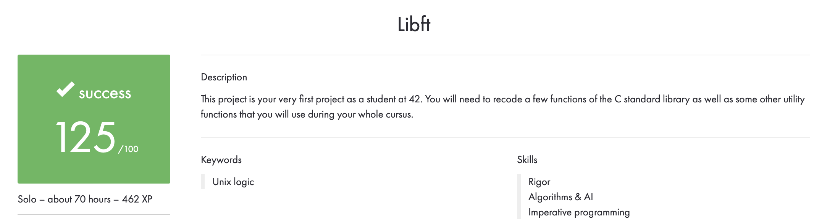
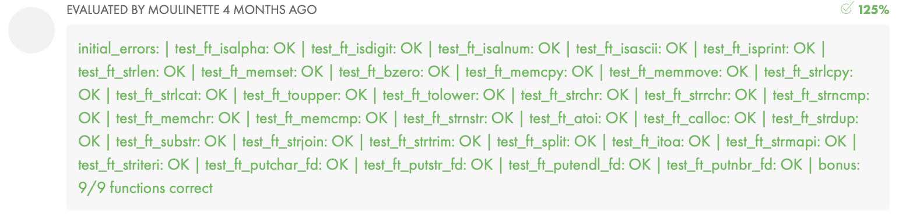

# Libft
Libft is my first ever 42 Common Core Curriculum project. It entails the creation of a custom library including essential functions from the Standard C Library, along with additional utility functions.

## Overview
This project serves as an invaluable initiation into C programming, providing an opportunity to explore its foundational concepts.

## Key Features
- Implementation of essential functions from the Standard C Library.
- Creation of additional utility functions to enhance programming efficiency.
- Rigorous testing of all code to ensure reliability and functionality.

## Usage
1. Clone the repository
   ```
   git clone git@github.com:dianazinchenko/libft.git
2. Go inside the project folder and compile the library
   ```bash
   cd libft
   make
3. To use the library, include the header file in your project
   ```c
   #include "libft.h"

## My Libft Results


